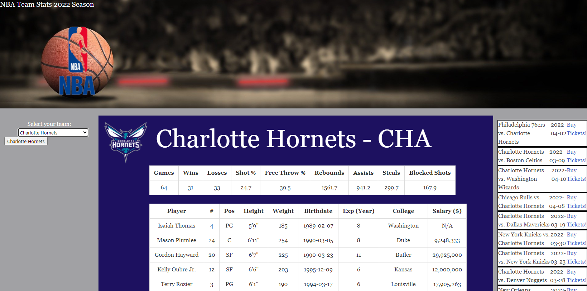

# NBA Team Stats

[Live Website Page](https://danchanyoungkim.github.io/Project-1-stat-website/)

## Description

We made a website that will help find your favorite team stats, player stats for that team, and upcoming event tickets quickly.  You select a team from a drop down menu or from previously searched team buttons.  It will display the selected teams current stats and player stats on tables in the middle of the page, and the next ten events for the selected team will be displayed.

### Tools Used
- HTML
- CSS
- Bulma (CSS Framework)
- Javascript
- sportsdata.io API
- ticketmaster API

## Contributors
[Andreas Kaiafas](https://github.com/Akaiafas526)

[Dan Kim](https://github.com/danchanyoungkim)

[Jason Snyder](https://github.com/jsnyder159?tab=repositories)

